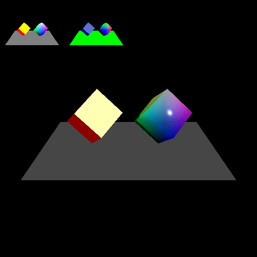

# ディファードレンダリング
複数のテクスチャへ一度にレンダリングを行い、その結果を利用します。

https://webglstudy.github.io/10_deferred_rendering/

# 課題
次の問題に挑戦してみてください。

- 光源やカメラを動かしてみよう
- 法線をビュー空間で記録して計算してみよう
- 法線を2成分の16ビット浮動小数点数フォーマットに格納してみよう

# 課題の進め方
次のように課題を解いてみてください。

- プロジェクトをforkします
- GitHub Pages の機能を使って、ホームページを立ち上げます
- 問題を解きます
- GitHub Pages で正答したか確認しましょう
